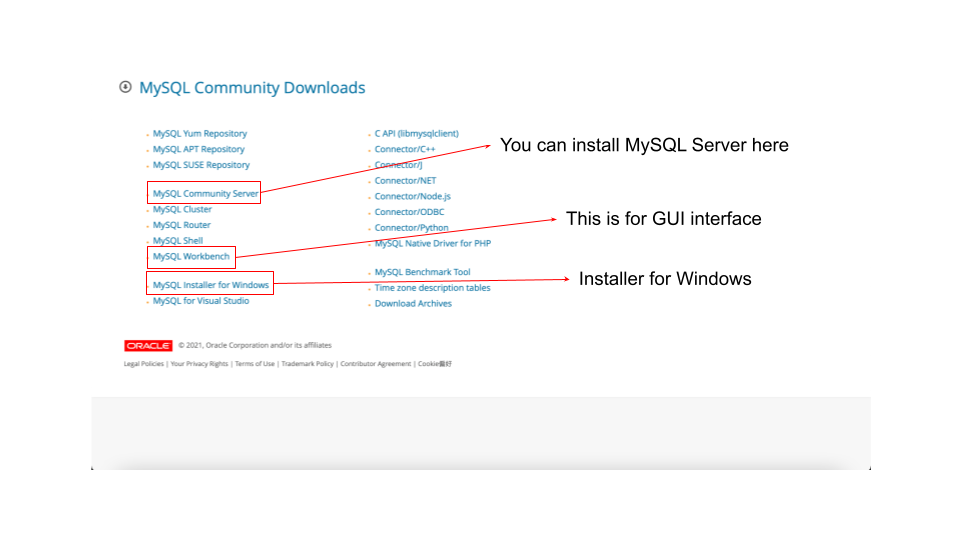
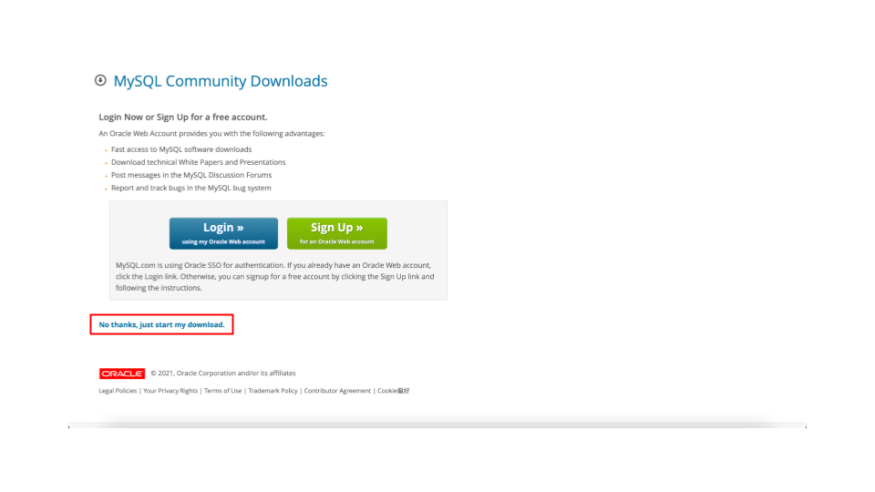
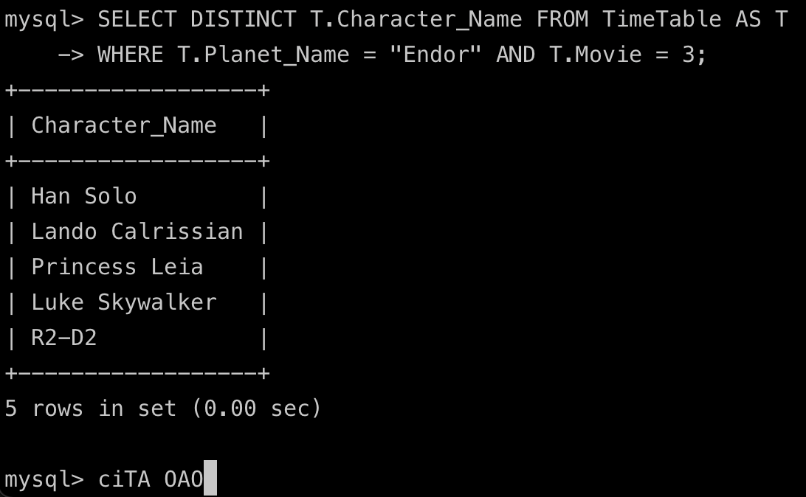

# Introduction-to-Computer-Hw8

## Deadline
2022/01/10 11:59

## How to install MySQL

Download the installer in https://dev.mysql.com/downloads/

- For macOS users, download MySQL Server and MySQL Workbench (GUI) separately.
- For Windows users, you can download the installer and execute it.




## How to build the database

```bash
# cd into this repo
mysql --local-infile=1 -u <username> -p
# Enter password and get into MySQL
source starwar.sql;
```

- Note that using `--local-infile=1` is due to the following errors:

  ```
  ERROR 2068 (HY000): LOAD DATA LOCAL INFILE file request rejected due to restrictions on access.
  ERROR 3948 (42000): Loading local data is disabled; this must be enabled on both the client and server
  ```

  If you still encounter this error, type the following command in MySQL and relaunch.

  ```
  SET GLOBAL local_infile = 1;
  ```

## Exercises:

Since the answer of the homework might not release before finals,
We prepare some exercises for you to practice:

- Exercise1: Who had been to Endor in movie 3?

```sql
SELECT DISTINCT T.Character_Name FROM TimeTable AS T
WHERE T.Planet_Name = "Endor" AND T.Movie = 3;
```

- Exercise2: Who visited his/her homeworld in movie 3?

```sql
SELECT DISTINCT T.Character_Name FROM TimeTable T, Characters C
WHERE C.Name = T.Character_Name AND T.Planet_Name = C.Homeworld AND T.Movie = 3;
```

- Exercise3: Show the characters names and the total time they spent in each planet among the movies.

```sql
SELECT T.Character_Name, SUM(T.Time_of_Departure - T.Time_of_Arrival) FROM TimeTable T
GROUP BY T.Character_Name;
```

- Exercise4: List the planets and movies Luke Skywalker has been to at the same time there is at least one human on the planet, too?

```sql
SELECT T_Luke.Planet_Name, T_Luke.Movie FROM TimeTable T_Luke
WHERE
    T_Luke.Character_Name = 'Luke Skywalker' AND
    EXISTS (
        SELECT \* FROM TimeTable T
        WHERE
        T.Character_Name != 'Luke Skywalker' AND
        T.Planet_Name = T_Luke.Planet_Name AND
        T.Movie = T_Luke.Movie AND
        T.Time_of_Departure >= T_Luke.Time_of_Arrival AND
        T.Time_of_Arrival <= T_Luke.Time_of_Departure AND
        T.Character_Name IN (SELECT C.Name FROM Characters C
                            WHERE C.Race = 'Human')
    )
;
```

Some more instructions you might use: JOIN, COUNT, NOT and MAX.
Best Luck to you!

## Questions:

You are asked to write SQL queries that answer the questions below (one query per question) and run them with MySQL. Some hints for columns to be selected are shown in the parentheses ().

- Q1: What planets did Princess Leia visit in movie 3?
- Q2: Who visited planets of his/her affiliation in movie 2?
- Q3: Find all characters that never visited any empire planets.
- Q4: How many times for each character to visit his/her homeworld? show character names and times appeared in TimeTable.
- Q5: For each movie, which character(s) visited the highest number of planets?

## Submission

You have to submit **2 files**, `result.pdf` and `<Your_student_ID>.txt`:

- `result.pdf`:
  The report should contain 5 **screenshots** of the results:

  ```
  SQL Homework
  StudentID & name

  1. [Screenshot of the result of Query 1]

  2. [Screenshot of the result of Query 2]
  
  ...
  ```

  If your screenshot is found the same as another student, **both of you will get 0 points**.
  You could prevent this by adding some words in the next command:
  
  

  Please **NOT** screenshot the whole windows, since it's hard for TAs to check the output result.

- `<Your_student_ID>.txt`: a pure text file with 5 lines of your SQL queries

  For example:

  ```
  1. SELECT DISTINCT T.Character_Name FROM TimeTable AS T WHERE T.Planet_Name = "Endor" AND T.Movie = 3;
  2. ...
  ```

## Grading

- 20 points for each query (100%)
- For this assignment, **creation of temporary tables is not allowed**, i.e., for each question, you have to write exactly one SQL statement.
- If your screenshot is hard to be identified (e.g. extreme low resolution, too small text, etc), we'll deduct some points
- **If your screenshot is found the same as another student, both of you will get 0 points.**
- Any invalid format (e.g., .zip/.rar/.7z ..., missing report, missing screenshots) of the submission will result in 0 points.
